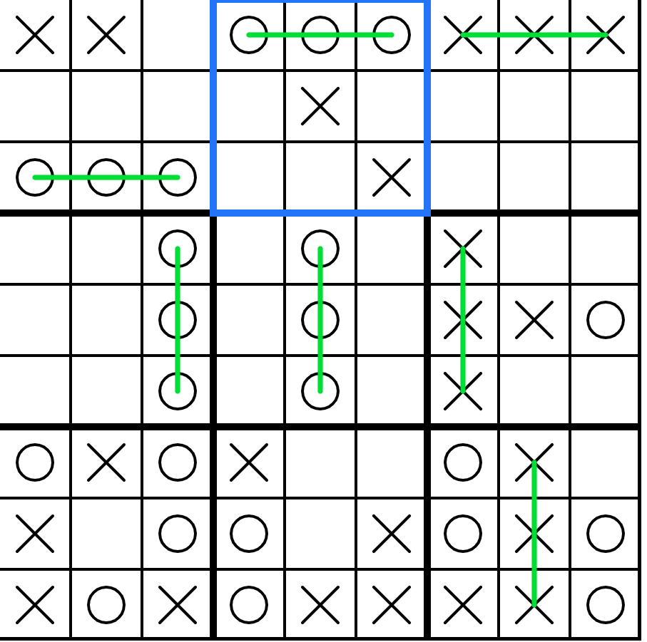

# AI Ultimate Tic Tac Toe V2
This is a university turned mini-passion project in JavaScript on Intelligent Systems (AI) for the Ultimate Tic Tac Toe game.
It uses the P5.js library for the graphics.

Ultimate Tic Tac Toe, as the name suggests, is an advanced version of the well-known game, Tic Tac Toe.
Similarily, the goal is to win 3 sub-boards in a line, and to win a sub-board you must form a line in it. Additionally, here's where it becomes challenging:
the previous move influences/limits the options of the next move. That is, each square maps to a sub-board. Thus, long-term planning and strategy are key! 

The AI itself is Minimax with Alpha-Beta (α–β) pruning to signficantly speed up the process of travesing the game tree and move options.

## Running the Project
  1. Download the project: 
 ```shell
 git clone https://github.com/MohamedElBakry/AI-UTTT-V2.git
 ```
  2. In the root directory of the project, serve/run it to localhost e.g.: 
  ```shell
  cd AI-UTTT-V2
  python -m http.server -d "dist"
  ```
  3. Open localhost in a browser and navigate to the src directory. If you used python the command above then follow this link: [localhost](http://localhost:8000).

Finally, while playing you may press `F12` then select the `Console` tab to see the AI's evaluation of the current positon in real time.

 ## Example Game
 The following image illustrates a game where the AI, as `X`, won versus the developer of this repo who was `O`.
 
 

 ***

## Improvements

1. Offline mode/PWA for on-the-go playing.
2. UI Clarifications:
    * Sub-board victory/draw. Cover the sub-board with the enlarged symbol of the winning player. 'Grey-out' a drawn sub-board.
    * Game victory/draw.
    * Potential move highlight with right-click
    * Evaluation Bar
3. Rules section 
4. Undo/Redo Move and Reset buttons.
5. Aggregate data and track win-rate iterations over AI.

*Feel free to provide suggestions.* :) 

## Rules
Ultimate Tic Tac Toe (UTTT) is a complex variant of the traditional Tic Tac Toe that requires strategic depth due to its additional layer of gameplay. Here are some strategies that might help you win at UTTT:

Center Control: Try to take control of the central squares of the main board as well as the central mini-boards. The central positions are advantageous because they allow more opportunities to create a line.

Force Plays: Make moves that force your opponent to play in a particular mini-board where you can set up a win. This is a key strategy in UTTT and involves thinking several moves ahead.

Two-Way Wins: Attempt to create scenarios where you have two potential ways to win in a mini-board, forcing the opponent to block one and allowing you to win with the other.

Defensive Play: Always be on the lookout for moves that might give your opponent a two-way win and block them. Sometimes playing defensively and blocking your opponent can be as important as trying to win a mini-board.

Corner Play: Occupying corners can be a strategic move because each corner square is part of three potential winning lines (vertical, horizontal, and diagonal).

Plan B: Always have a fallback plan. If you are sent to a mini-board where you cannot win, try to position yourself to be sent to a favorable mini-board next or to at least block your opponent.

Randomness: In the early game, it might be beneficial to play in such a way that the board stays open and your moves are less predictable. This can make it harder for your opponent to plan.

Avoiding Draws: Be cautious about winning a mini-board that could lead to a draw in the main board. Sometimes not winning a mini-board immediately can be strategic.

Remember, each move in UTTT not only affects the mini-board you're playing in but also determines which mini-board your opponent must play in next. This "send" mechanic is crucial and should always be considered before making a move.

Lastly, practice different scenarios. UTTT has a much larger state space than traditional Tic Tac Toe, and the best way to get better is to play multiple games and learn from each outcome.